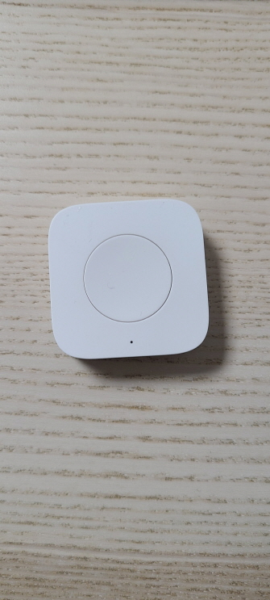
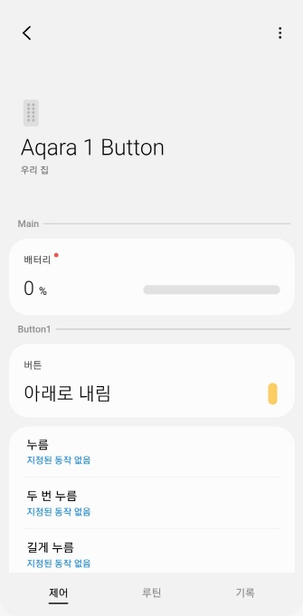

# Edge Driver: Zigbee Aqara Mini Button (WXKG02LM)
It is the SmartThings Edge Driver for Zigbee Aqara T1 mini Button. 

## Device

## App UI Screen

## Support Device
See fingerprint.yml in src

## License
It is released under the Apache 2.0 License.