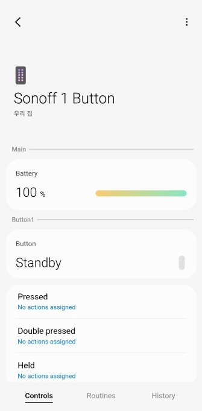

# Edge Driver: Zigbee Sonoff Button
Currently, it does NOT work.!!!!

It is the SmartThings Edge Driver for zigbee sonoff button.  
It supports 1 buttons.  

## Device UI Screen

## Support Device
See fingerprint.yml in src

## License
It is released under the Apache 2.0 License.