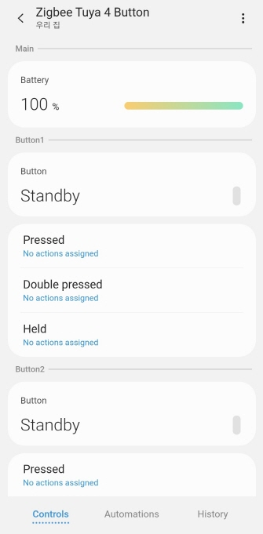

# Edge Driver: Zigbee Tuya Button
The SmartThings Edge Driver for Tuya-platform based Zigbee buttons supports devices with 1, 2, 3 and 4 buttons.

## Device

## App UI Screen

## Support Device
See [fingerprints.yml](./fingerprints.yaml)

### Known Issue

#### TS004F
If the device does not operate properly, change the scene mode.
For details, see your device manual.

#### TS0601 (EF00 Cluster)
Single Click + Hold works, but the input may sometimes be ignored.
Double Click may not function reliably.

## License
It is released under the Apache License 2.0.

