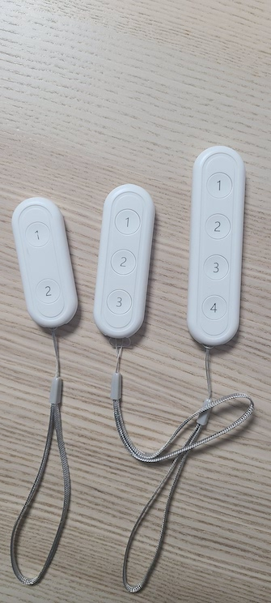

# Edge Driver: Zigbee Tuya Button
It is the SmartThings Edge Driver for tuya-platform based zigbee button.  
It supports 1,2,3 and 4 buttons.  

## Device

## App UI Screen

## Support Device
See [fingerprints.yml](./fingerprints.yml)

## License
It is released under the Apache 2.0 License.