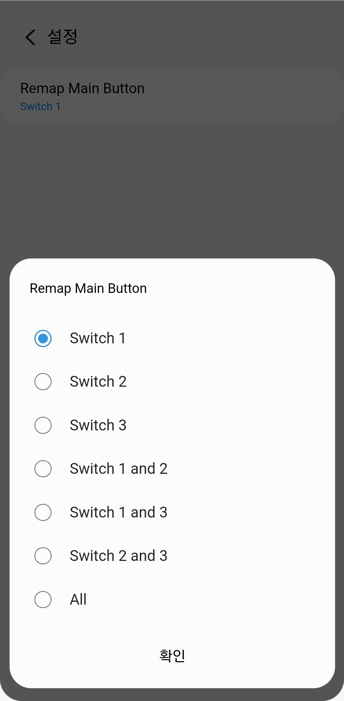

# Edge Driver: Zigbee Tuya Enhanded Switch 
It is the SmartThings Edge Driver for tuya-platform based zigbee switch. (Tuya, Zemismart ...)   
The general zigbee switch might work

## Device

## App UI Screen

## Support Device
See fingerprint.yml in src

## License
It is released under the Apache 2.0 License.